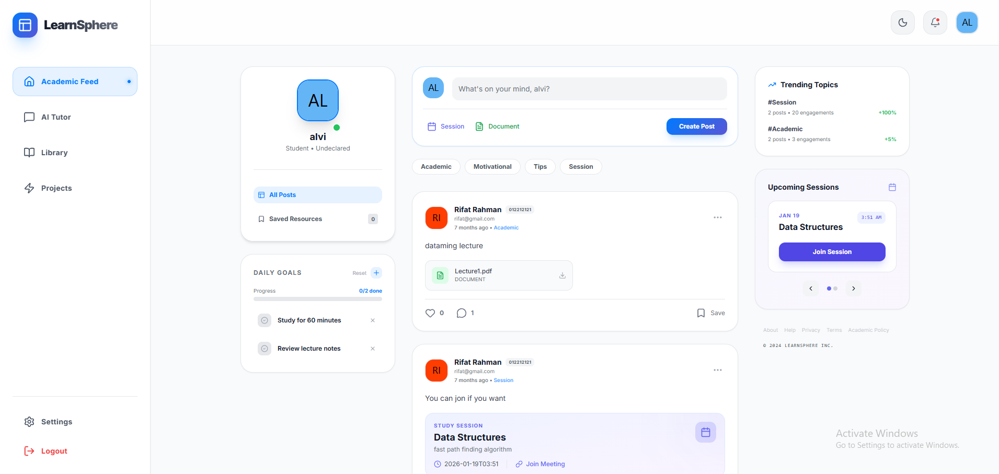
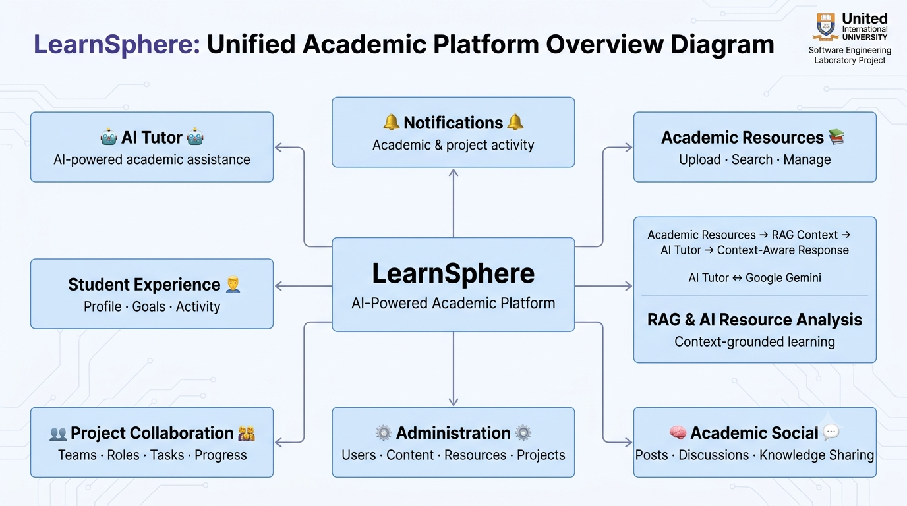
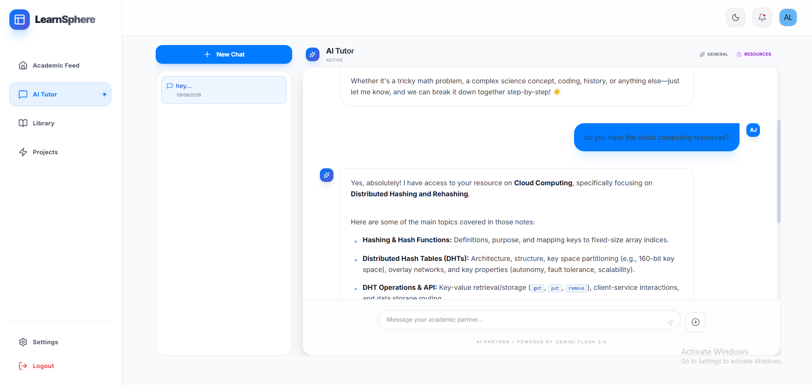
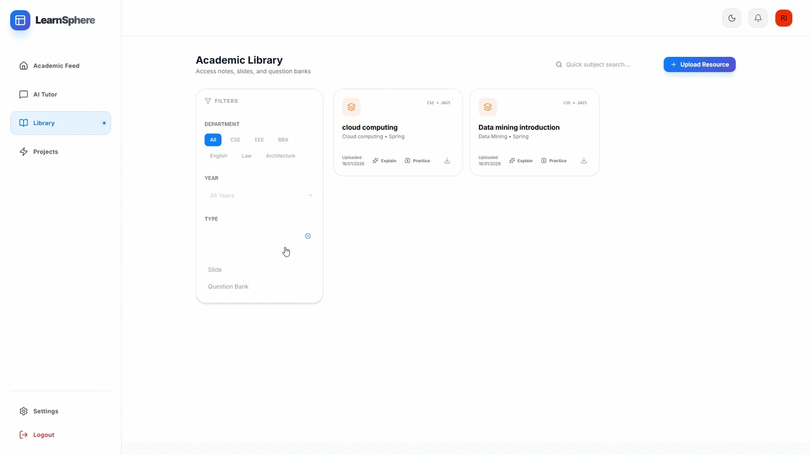
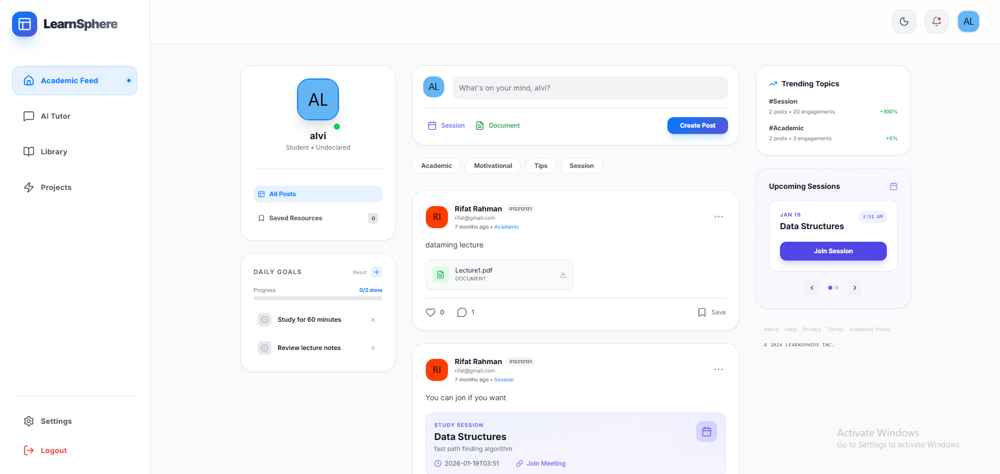
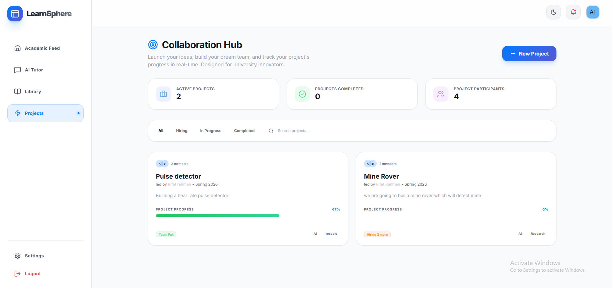
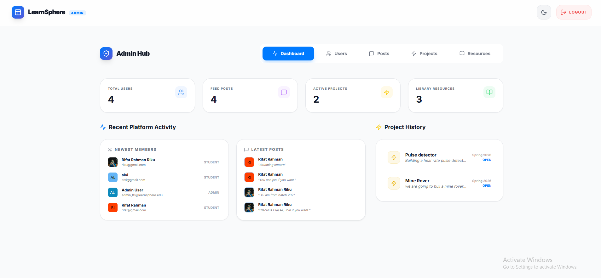

# 🎓 LearnSphere

### An AI-Augmented Academic Partner for Learning, Collaboration & Knowledge Sharing

> **LearnSphere** is a full-stack academic platform designed to bring intelligent learning assistance, academic resource management, social learning, and project collaboration into a single unified environment.

Built as a **Software Engineering Laboratory project at United International University (UIU)**, LearnSphere explores how modern web technologies and generative AI can be combined to create a more connected and personalized academic experience.

---

## 📸 Project Showcase

> 

---

## 📖 Overview

Students often rely on multiple disconnected platforms for academic resources, discussions, study sessions, project collaboration, and learning assistance.

LearnSphere was designed around a simple idea:

> **What if students could learn, collaborate, share knowledge, manage projects, and interact with an AI tutor from one academic platform?**

The system brings several academic workflows together:

<p align="center">
   
</p>

Rather than functioning as only an AI chatbot or a conventional social platform, LearnSphere combines these components into a unified academic ecosystem.

---

# 💡 Motivation & Problem Statement

Modern university students frequently encounter several challenges:

* Academic resources are scattered across different platforms.
* Understanding lecture materials often requires searching through multiple sources.
* Students lack a centralized environment for academic discussions.
* Finding suitable teammates for university projects can be difficult.
* Project tasks and collaboration are often managed using unrelated tools.
* Generic AI assistants do not necessarily understand a student's own academic resources.

LearnSphere attempts to address these problems by providing a centralized platform where students can:

**Learn → Share → Collaborate → Manage → Improve**

The goal was not simply to build another academic website, but to explore how different software engineering concepts and AI capabilities could be integrated into one practical system.

---

# ✨ Key Features

## 🤖 AI Tutor

LearnSphere includes an AI-powered tutor capable of interacting with students through conversational learning.

The tutor supports:

* AI-powered academic conversations
* Conversation history
* Context-aware responses
* Academic resource-based conversations
* PDF upload for learning assistance

---

## 🧠 Retrieval-Augmented AI Learning

One of the major features of LearnSphere is its **Resource Mode**, which uses a Retrieval-Augmented Generation (RAG) workflow.

Students can upload academic PDF resources, after which the system extracts their text and makes the content available as context for the AI tutor.

The basic workflow is:

```text
Academic PDF
     │
     ▼
PDF Upload
     │
     ▼
Text Extraction
     │
     ▼
Resource Storage
     │
     ▼
Relevant Resource Context
     │
     ▼
Gemini AI
     │
     ▼
Context-Aware Answer
```

This allows the AI tutor to provide responses grounded in the student's uploaded academic materials rather than relying exclusively on general model knowledge.

> 

---

# 📚 Intelligent Academic Resource Library

LearnSphere provides a centralized space for students to **discover, manage, and learn from academic resources**.

Supported resources include:

* 📘 Notes
* 📊 Slides
* 📝 Question Banks

Students can search and filter resources, while AI-powered analysis can transform uploaded materials into interactive learning content.

The resource analysis provides two modes:

* 🪄 **Explain** — generates summaries, key concepts, terminology explanations, and student-friendly insights.
* 🧠 **Practice** — generates MCQs, short-answer questions, and answer explanations.

> 

> **From academic resource → AI analysis → interactive learning.**

---

# 🌐 Academic Social Feed

LearnSphere contains an academic-focused social feed where students can share knowledge and interact with other students.

Posts can be categorized as:

* 📘 Academic
* 💡 Motivational
* 📝 Tips
* 🗓️ Session

Users can create and manage posts, interact through likes and threaded discussions, save content, and share files or study sessions.

> 

---

# 🚀 Project Collaboration Hub

LearnSphere includes a dedicated **Project Collaboration Hub** for university projects.

Students can create and discover projects while managing the people and work involved in those projects.

Project information includes the **title, description, trimester, year, status, tags, required roles, team size, current members, and overall progress**. It also provides a clear overview of the project’s **team composition and current development status**.

Students can apply to join projects, while project owners can manage applications and team membership.

Supported project statuses include:

* Open
* In Progress
* Completed

> 

---

# 🛠️ Administrative Dashboard

LearnSphere includes a dedicated **Administrative Dashboard** for centralized platform management.

Administrators can monitor **system statistics, recent activity, and system information**, while managing users, posts, projects, and academic resources from a single interface.

The dashboard supports **user management, post moderation, project management, and resource management**, including viewing, editing, deleting, searching, and downloading content where applicable.

> 

---

# 🏗️ System Architecture

LearnSphere follows a full-stack architecture consisting of a React-based frontend, an Express backend, SQLite database, file storage, PDF processing, and Google Gemini AI services.

```text
                    ┌─────────────────────┐
                    │       Student       │
                    └──────────┬──────────┘
                               │
                               ▼
                 ┌─────────────────────────┐
                 │ React + TypeScript UI   │
                 │        + Vite           │
                 └────────────┬────────────┘
                              │
                              ▼
                 ┌─────────────────────────┐
                 │      REST API Layer     │
                 └────────────┬────────────┘
                              │
                              ▼
                 ┌─────────────────────────┐
                 │   Express.js Backend    │
                 └───────┬─────────┬───────┘
                         │         │
              ┌──────────┘         └──────────┐
              ▼                               ▼
     ┌─────────────────┐             ┌─────────────────┐
     │ SQLite Database │             │   Gemini AI     │
     └─────────────────┘             └─────────────────┘
              │
              ▼
     ┌─────────────────┐
     │ File / PDF Data │
     └─────────────────┘
```

---

# 🧰 Technology Stack

| Category                | Technologies                               |
| ----------------------- | ------------------------------------------ |
| **Frontend**            | React · TypeScript · Vite · Tailwind CSS   |
| **Backend**             | Node.js · Express.js · SQLite              |
| **AI**                  | Google Gemini · RAG · AI Document Analysis |
| **Document Processing** | pdf-parse · Multer                         |
| **Tools**               | npm · Git · tsx                            |
| **Database**            | SQLite                                     |

---

# 📁 Project Structure

The major project structure is organized as follows:

```text
Learn-Sphere/
│
├── components/
│   ├── GlassCard.tsx
│   ├── Layout.tsx
│   ├── PostCard.tsx
│   ├── CreatePostModal.tsx
│   └── Toast.tsx
│
├── contexts/
│   └── ThemeContext.tsx
│
├── services/
│   ├── db.ts
│   └── geminiService.ts
│
├── utils/
│   └── date.ts
│
├── views/
│   ├── Auth.tsx
│   ├── Home.tsx
│   ├── Tutor.tsx
│   ├── Library.tsx
│   ├── Profile.tsx
│   ├── Settings.tsx
│   ├── Notifications.tsx
│   ├── Projects.tsx
│   ├── ProjectHub.tsx
│   ├── ProjectDetail.tsx
│   └── Admin.tsx
│
├── server/
│   ├── db.ts
│   └── index.ts
│
├── scripts/
│   └── register-admin.js
│
├── uploads/
│   └── resources/
│
├── App.tsx
├── index.tsx
├── types.ts
├── index.html
├── package.json
├── vite.config.ts
└── database.sqlite
```

---

# ⚙️ Installation & Setup

## Prerequisites

Before running LearnSphere, make sure the following are installed:

* **Node.js** 20 or later
* **npm**
* A **Google Gemini API key**

---

## 1. Clone the Repository

```bash
git clone https://github.com/alvi-uiu/Learn-Sphere.git
cd Learn-Sphere
```

---

## 2. Install Dependencies

```bash
npm install
```

---

## 3. Configure Environment Variables

Create a `.env` file:

```env
GEMINI_API_KEY=your_gemini_api_key
```

---

## 4. Start the Development Server

```bash
npm run dev
```

The development environment uses:

```text
Frontend → http://localhost:3006
Backend  → http://localhost:3001
```

---

## 5. Create Admin & User Credentials

### Admin Credential (Randomly Generated)

Run the CLI script to generate a new admin account:

```bash
node scripts/register-admin.js
```

This prints a new `admin_<random>@learnsphere.edu` email and password to the console.

### User Credential (from Sign Up page)

You can create a new student user account directly from the frontend Sign Up page during application use.

---

# 📄 License

This project was developed primarily for **educational and portfolio purposes**.

